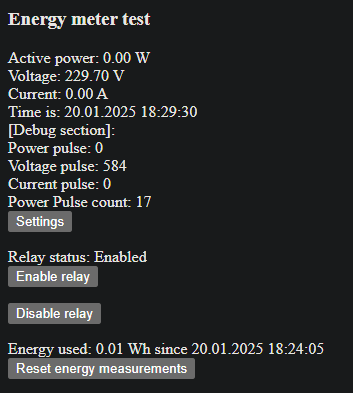

# Smart Plug

This repository contains a simple software written for SmartDGM PP-W162 SmartPlugs (more commonly known as Tuya).

## Features
- Hosts local website allowing checking parameters and changing configurations.
- Remote enabling and disabling power relay (by making HTTP GET request to http://IP/enable or http://IP/disable, or via the website).
- Showing realtime voltage, current and active power statistics on the website.
- Reporting statistics mentioned above to a data collection server (available on another repo).
- Collecting energy usage statistics (how many Wh used in period of time) and sending it to data collection server every period of time, allowing to analyze household power consumption trends.
- Ability to perform OTA update via the website instead of having to connect to UART.

## Screenshots
### Main page

### Settings page

### Main site with debug options

### Version tracking capability

## Usage

Project management system used is platformio.

First copy config-sample.cfg and rename it to config.cfg. You can optionally replace SSID and KEY within the file to your SSID and WiFi password, but it's not necessary as the device will create it's own AP in case of connection error, allowing you to change these options from config site.

Use platformio action "Build filesystem image" to build the littlefs filesystem that needs to be uploaded into the device. It will be stored inside `.pio/build/esp8285/littlefs.bin`

Then choose build. A firmware file will be created called `firmware.bin` .

Now you can either upload both files to the ESP8285 MCU either via UART programming, or another OTA updater.

## OTA Updates
Enter http://IP/update after the device was flashed.

First upload the filesystem image (will require a device reboot).

Then upload `firmware.bin` and the device will reboot.

When making changes to flash filesystem contents, always remember about backwards compatibility - otherwise after flashing the filesystem via OTA the device might require an USART connection to be unbricked 